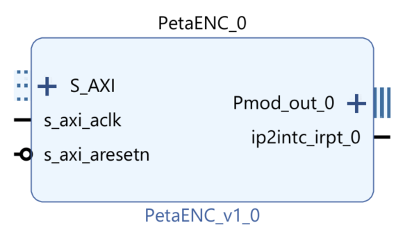

# IP Block - Debouncer and AXI GPIO for the PmodENC

This repositories provide an IP block design that includes a debouncer and AXI GPIO for the PmodENC rotary encoder. This IP block can be integrated into a Vivado project to facilitate the use of a debounced encoder input in FPGA designs.



## Adding the IP Repository to Vivado

1. **clone the repository**:
    First, clone the repository to your local machine:
    
    ```sh
    git clone https://github.com/TER-Zybo/PetaENC
    ```

2. **Open Vivado**:
   - Launch Xilinx Vivado Design Suite on your computer.

3. **Add IP Repository**:
   - In the `Project Settings` window, navigate to `IP > Repository`.
   - Click the `+` button to add a new IP repository.
   - Browse to the location of the cloned repository and select the repository directory.
   - Click `OK` to add the repository.
